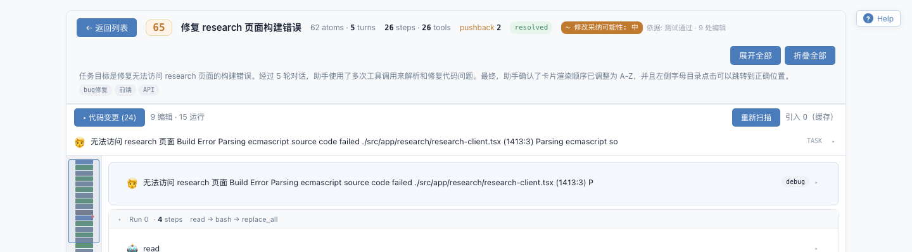
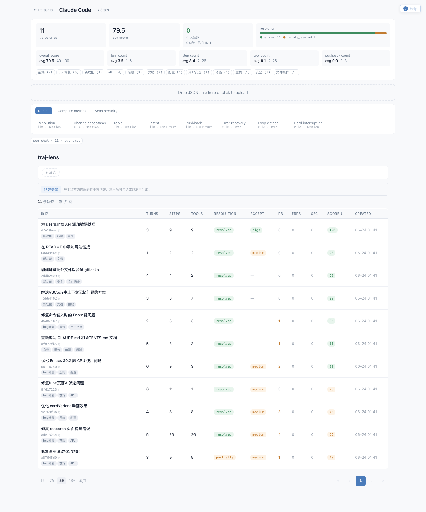
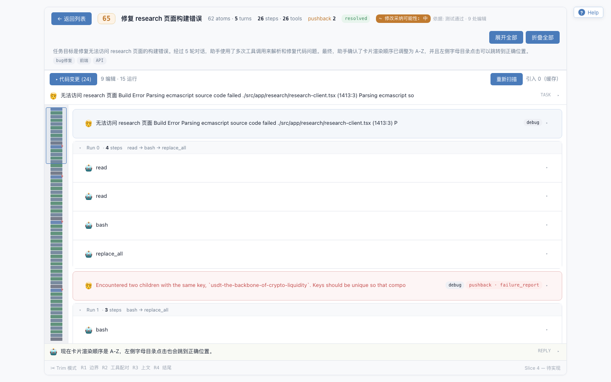

# traj-lens

Coding Agent 轨迹分析平台。导入 Claude Code、Codex CLI、OpenAI messages、SWE-chat
等轨迹日志，归一成统一 typed-item 模型，做标注、指标、可视化和训练数据导出。

当前项目主要面向本地或私有环境部署。已实现：多格式 ingest、规则/LLM 标注、
内置指标、数据集浏览、单轨迹 viewer、可选 Semgrep 扫描、panguml2 SFT 导出、
以及同服务器路径直读 ingest 集成。

## 快速开始

需要 Python 3.12+、`uv`、Node 18+。

```bash
make install
make build

uv run trajlens ingest tests/samples/claude_code/cc_small.jsonl
make serve
```

打开 <http://127.0.0.1:8000>。默认只监听 `127.0.0.1:8000`；需要局域网或服务器访问时：

```bash
uv run trajlens serve --host 0.0.0.0 --port 9000
```

`trajlens serve` 启动时会检查 `web/dist` 是否缺失或落后于前端源码，并自动重建。
不希望自动构建时可加 `--no-build`。

## 可选分析流程

基础导入、浏览、指标和导出不需要 LLM key。LLM 标注需要先配置 `.env`：

```bash
cp .env.example .env
$EDITOR .env

uv run trajlens annotate config/annotators/resolution.yaml
uv run trajlens metrics
uv run trajlens export _default --format panguml2 --output export.jsonl
```

规则标注器不需要 LLM 配置，例如：

```bash
uv run trajlens annotate config/annotators/hard_interruption.yaml
```

## 界面

数据集概览：



数据集详情：统计、筛选、标注任务、扫描和导出记录。



单轨迹 viewer：step 分组、工具调用、pushback 高亮和 typed-item 明细。



## 能力范围

- **导入**：通过 adapter 识别并解析 JSON/JSONL 轨迹。
- **归一化**：保留 raw bytes 作为导出真相，同时生成 canonical Items 用于分析。
- **标注**：支持 session、user turn、step 级规则/LLM 标注。
- **指标**：内置 tool count、turn count、pushback count、success score 等指标。
- **浏览**：按数据集查看统计、筛选轨迹，并下钻到单条轨迹。
- **安全扫描**：安装 Semgrep 后可扫描轨迹中的代码变更。
- **导出**：当前支持选择数据集切片导出为 panguml2 SFT JSONL。

## 架构

```text
raw logs -> adapters -> canonical Trajectory/Items
                         -> annotators
                         -> metrics
                         -> viewer / exporters
```

主要目录：

```text
config/        LLM profile 和 annotator YAML
src/trajlens/  core、adapters、store、annotate、metrics、export、api、cli
web/           Vite + React viewer
tests/         单测和样例轨迹
docs/          部署、集成、设计记录和 TODO
```

新增输入格式时实现 `sniff(raw) -> bool` 和 `parse(raw) -> Trajectory`，并在
`src/trajlens/adapters/__init__.py` 注册。标注器和导出器也采用小注册表模式。

## 第三方集成

同服务器系统可以通过绝对路径把轨迹文件交给 traj-lens 导入，避免先下载再上传。
该能力默认关闭，配置 `TRAJLENS_INGEST_ROOTS` 后启用。

- `GET /api/v1/integration`：返回集成清单。
- `POST /api/v1/ingest/path`：异步导入白名单内的服务器路径。
- `TRAJLENS_INGEST_TOKEN`：为集成接口启用 Bearer 鉴权。

完整契约见 [docs/INTEGRATION.md](docs/INTEGRATION.md)。

## 文档

| 主题 | 位置 |
|---|---|
| 私有部署、systemd、Docker、反代、备份 | [docs/DEPLOY.md](docs/DEPLOY.md) |
| 第三方系统集成 | [docs/INTEGRATION.md](docs/INTEGRATION.md) |
| 模型和架构设计 | [docs/superpowers/specs/2026-06-21-traj-lens-design.md](docs/superpowers/specs/2026-06-21-traj-lens-design.md) |
| 当前 TODO 和取舍 | [docs/TODO.md](docs/TODO.md) |
| 协作和提交约定 | [CLAUDE.md](CLAUDE.md) |
| API 参考 | 启动后访问 `/docs` 或 `/openapi.json` |

## 开发

```bash
make help
make test
make typecheck
make build
```

技术栈：Python 3.12、Pydantic v2、FastAPI、stdlib `sqlite3`、Typer、React、
Vite、TanStack。
